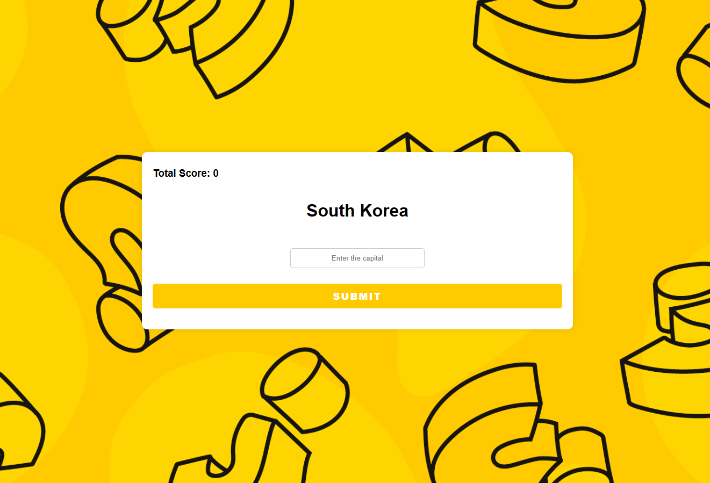

# 🧠 Capital City Quiz

A simple quiz web application built with **Node.js**, **Express**, and **PostgreSQL**. Users are challenged to guess the capital city of a given country. The quiz tracks the score and ends when a wrong answer is submitted.

## 🌍 Features

- Renders country names dynamically and receives answers via form
- Checks user input against the correct capital (case-insensitive)
- Displays ✔️ or ✖️ feedback based on correctness
- Tracks total score and ends the game on the first incorrect answer
- Allows restarting the quiz
- Retrieves country-capital data from a **PostgreSQL** database
- Built with **EJS** templates and **Express** server

## 📁 Project Structure

```
project-root/
├── public/
│   └── styles/
│       └── main.css          # Stylesheet for the quiz
├── views/
│   └── index.ejs             # EJS template for quiz page
├── capitals.csv              # (optional) source data for DB
├── .gitignore
├── index.js                  # Main Express server
├── package.json
├── package-lock.json
└── README.md
```

## 🚀 Getting Started

### ✅ Prerequisites

- Node.js installed
- PostgreSQL running and accessible
- `.env` file with your PostgreSQL credentials:

```env
PG_USER=your_username
PG_PASSWORD=your_password
PG_HOST=localhost
PG_DATABASE=your_database
PG_PORT=5432
```

### 🔧 Install dependencies

```bash
npm install
```

### ▶️ Start the server

```bash
node index.js
```

Visit `http://localhost:3000` in your browser.

## 🗄️ Database Setup

Make sure your PostgreSQL database has a table like:

```sql
CREATE TABLE capitals (
  country TEXT,
  capital TEXT
);
```

You can use the `capitals.csv` file to populate the table manually or with a script.

## 🧪 How It Works

1. On accessing `/`, a random country is selected and rendered.
2. The user types the capital and submits the form.
3. If the answer is correct, the score increases and a new country is shown.
4. If incorrect, the game ends and a restart option appears.

## 📸 Preview



## 🧑‍🏫 Credits

This project was developed as part of the [The Complete 2024 Web Development Bootcamp](https://www.udemy.com/course/the-complete-web-development-bootcamp/) by Dr. Angela Yu.
